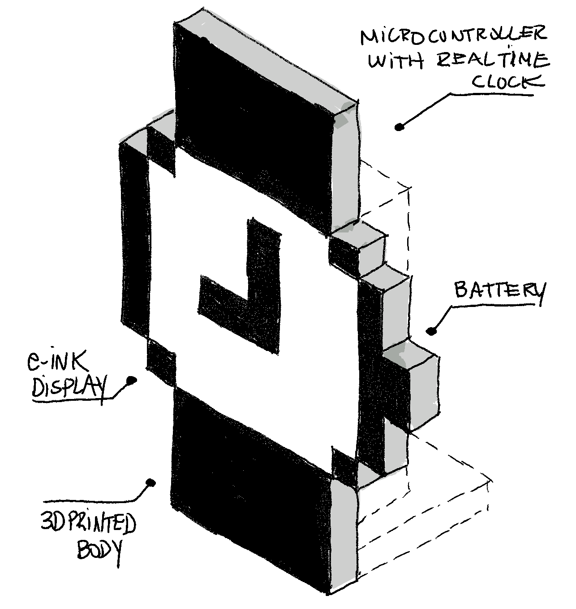

# System Watch Clock

> A pixelated desk clock inspired by the original Macintosh System watch cursor.

## Idea

## Progress

**March 2023**

* [Clock display prototype](images/demo1.gif) (`.gif`) — see [`code/`](https://github.com/pndurette/system-watch-clock/tree/af53b8d0a9978f969d18a1c27445faceb8c2ee43/code)

## To do

**MVP**

* [x] [Code] Clock display code
* [ ] [Electronics] Source ePaper
* [ ] [Electronics] Source microcontroller
* [ ] [Electronics] Source RTC
* [ ] [Code] Getting real-time
* [ ] [Code] Setting real-time
* [ ] [3D] Design enclosure

**Nice to have**

* [ ] Battery power
  * [ ] [Electronics] Source battery
  * [ ] [Code] Power-saving
  * [ ] [Code] Power health